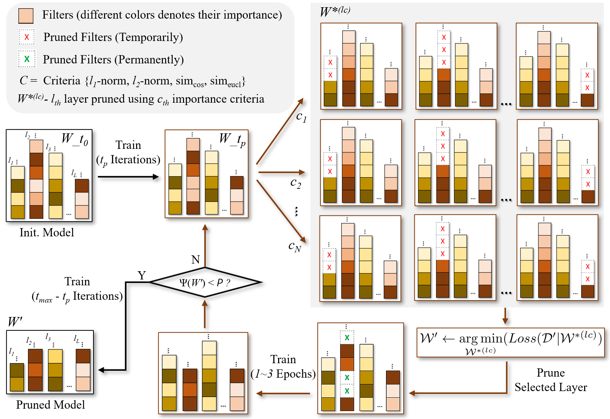

# LAASP: Loss-Aware Automatic Selection of Filter Pruning Criteria for Deep Neural Network Acceleration 


> [Deepak Ghimire, Kilho Lee, and Seong-heum Kim, “Loss-aware automatic selection of structured pruning criteria for deep neural network acceleration,” Image and Vision Computing, vol. 136, p. 104745, 2023.](https://www.sciencedirect.com/science/article/pii/S0262885623001191)

**Abstract**: Structured pruning is a well-established technique for compressing neural networks, making them suitable for deployment in resource-limited edge devices. This study presents an efficient loss-aware automatic selection of structured pruning (LAASP) criteria for slimming and accelerating deep neural networks. The majority of pruning methods employ a sequential process consisting of three stages, 1) training, 2) pruning, and 3) fine-tuning, whereas the proposed pruning technique adopts a pruning-while-training approach that eliminates the first stage and integrates the second and third stages into a single cycle. The automatic selection of magnitude or similarity-based filter pruning criteria from a specified pool of criteria and the specific pruning layer at each pruning iteration is guided by the network's overall loss on a small subset of training data. To mitigate the abrupt accuracy drop due to pruning, the network is retrained briefly after each reduction of a predefined number of floating-point operations (FLOPs). The optimal pruning rates for each layer in the network are automatically determined, eliminating the need for manual allocation of fixed or variable pruning rates for each layer. Experiments on the VGGNet, ResNet, and MobileNet models on the CIFAR-10 and ImageNet benchmark datasets demonstrate the effectiveness of the proposed method. In particular, the ResNet56 and ResNet110 models on the CIFAR-10 dataset significantly improve the top-1 accuracy compared to state-of-the-art methods while reducing the network FLOPs by 52%. Furthermore, pruning the ResNet50 model on the ImageNet dataset reduces FLOPs by more than 42% with a negligible 0.33% drop in the top-5 accuracy. 

```
@article{GHIMIRE2023104745,
    title = {Loss-aware automatic selection of structured pruning criteria for deep neural network acceleration},
    author = {Deepak Ghimire and Kilho Lee and Seong-heum Kim},
    journal = {Image and Vision Computing},
    volume = {136},
    pages = {104745},
    year = {2023},
    issn = {0262-8856},
    doi = {https://doi.org/10.1016/j.imavis.2023.104745},
    url = {https://www.sciencedirect.com/science/article/pii/S0262885623001191},
    keywords = {Deep neural networks, Structured pruning, Pruning criteria},
}
```

> Note: Filter removal is based on [VainF/Torch-Pruning](https://github.com/VainF/Torch-Pruning).



## Table of Contents

- [Requirements](#requirements)
- [Models](#models)
- [VGGNet on CIFAR-10](#vggnet-on-cifar-10)
  - [Training-Pruning](#training-pruning)
  - [Evaluation](#evaluation)
- [ResNet on CIFAR-10](#resnet-on-cifar-10)
  - [Training-Pruning](#training-pruning-1)
  - [Evaluation](#evaluation-1)
- [ResNet on ImageNet](#resnet-on-imagenet)
  - [Prepare ImageNet dataset](#prepare-imagenet-dataset)
  - [Training-Pruning](#training-pruning-2)
  - [Evaluation](#evaluation-2)
- [Reference](#reference)

## Requirements
- Python 3.9.7
- PyTorch 1.10.2
- TorchVision 0.11.2
- matplotlib 3.5.1
- scipy 1.8.0

## Models

| Model        | Dataset | Baseline Top@1 Acc. (%) | Pruned Top@1 Acc. (%) | Top@1 Acc. Drop (%) | Pruned Top@5 Acc. (%) | FLOPs RR (%)| 
|:--------------|:-------:|:-----------------------:|:---------------------:|:-------------------:|:---------------------:|:-----------:|
| [Vgg16](https://drive.google.com/drive/folders/1y29ViTn50rBheigpRqqhoFbqBdlot0m0?usp=sharing)         | CIFAR10 |  93.79 ± 0.23           | 93.90 ± 0.16          | -0.11               | -                    | 34.6         |
| [Vgg16](https://drive.google.com/drive/folders/1L41gwRmOZlAXO6H07SAZEtGXjdlBdHFo?usp=sharing)        | CIFAR10 |  93.79 ± 0.23           | 93.79 ± 0.11          | 0.00                | -                    | 60.5         |
|         |  |   |              |         | | | 
| [ResNet32](https://drive.google.com/drive/folders/1Lu4it1XjvnluZpno3mzoQgl9YELVwQuO?usp=sharing)     | CIFAR10 | 93.12 ± 0.04            | 92.64 ± 0.09          | 0.48                | -                    | 53.3         |
| [ResNet56](https://drive.google.com/drive/folders/1LvWNBparWqcSAfBJecukR94BwMcHcYhZ?usp=sharing)     | CIFAR10 | 93.61 ± 0.11            | 93.04 ± 0.08          | 0.12                | -                    | 52.6         |
| [ResNet110](https://drive.google.com/drive/folders/1LwXjwQcdiz4eIPprpSOUCoUG7yX8O3vH?usp=sharing)    | CIFAR10 | 94.41 ± 0.07            | 94.17 ± 0.16          | 0.24                | -                    | 52.5         |
| [ResNet110](https://drive.google.com/drive/folders/1y6WDGzDcrTTSfpB_d0aHWnLHM4lfv9_D?usp=sharing)    | CIFAR10 | 94.41 ± 0.07            | 93.58 ± 0.21          | 0.83                | -                    | 58.5         | 
|         |  |   |              |         | | |
| [ResNet18](https://drive.google.com/drive/folders/1LCsKknuWS81vlHcTxY5B7NIvDQkUf_24?usp=sharing)     | ImageNet | 70.58                  | 68.66                 | 1.92                | 88.50                | 42.2         |
| [ResNet18](https://drive.google.com/drive/folders/1LC_mJ8TK1gx_YQ46KsojR21hG0ixYs-2?usp=sharing)     | ImageNet | 70.58                  | 68.12                 | 2.46                | 88.07                | 45.4         |
| [ResNet34](https://drive.google.com/drive/folders/1LC9JS32vEsl7_GKkDRV83jU4coqmtIIO?usp=sharing)     | ImageNet | 73.90                  | 72.65                 | 1.25                | 90.98                | 41.4         |
| [ResNet34](https://drive.google.com/drive/folders/1LC6IU7V1N8Dw6v3Yj3Z68dESe-ANiv1F?usp=sharing)     | ImageNet | 73.90                  | 72.37                 | 1.53                | 90.80                | 45.4         |
| [ResNet50](https://drive.google.com/drive/folders/1LB-EIZYu69L5L0C1W5jmP62FVYxgPpIT?usp=sharing)     | ImageNet | 76.48                  | 75.85                 | 0.63                | 92.81                | 42.3         | 
| [ResNet50](https://drive.google.com/drive/folders/1L5mIhmNxHMW1gnVSkmsJl14bQPnP_tJc?usp=sharing)     | ImageNet | 76.48                  | 75.44                 | 1.04                | 92.59                | 53.9         | 
|         |  |   |              |         | | | 
| [MobileNetV2](https://drive.google.com/drive/folders/1zt4JcPSlkJjJARDei2f0cSy-4WBeXEDv?usp=sharing)  | ImageNet | 71.79                  | 71.00                 | 0.79                | 89.86                | 30.0         |
| [MobileNetV2](https://drive.google.com/drive/folders/1ztFsVI87toRPOKywqpENR4ubGS7Gj9vt?usp=sharing)  | ImageNet | 71.79                  | 68.45                 | 3.34                | 88.40                | 54.5         |

## VGGNet on CIFAR-10

### Training-Pruning

```ruby
sh .\scripts\vgg16_cifar10\run_vgg16_pruning.sh
```

### Evaluation

```ruby
sh .\scripts\vgg16_cifar10\run_vgg16_eval.sh
```

## ResNet on CIFAR-10

### Training-Pruning

```ruby
sh .\scripts\resnet_cifar10\run_resnet_cifar10_pruning.sh
```

### Evaluation

```ruby
sh .\scripts\resnet_cifar10\run_resnet_cifar10_eval.sh  
```

## ResNet on ImageNet

### Prepare ImageNet dataset

- Download the images from http://image-net.org/download-images

- Extract the training data:

  ```ruby
  mkdir train && mv ILSVRC2012_img_train.tar train/ && cd train
  tar -xvf ILSVRC2012_img_train.tar && rm -f ILSVRC2012_img_train.tar
  find . -name "*.tar" | while read NAME ; do mkdir -p "${NAME%.tar}"; tar -xvf "${NAME}" -C "${NAME%.tar}"; rm -f "${NAME}"; done
  cd ..
  ```

- Extract the validation data and move images to subfolders:

  ```ruby
  mkdir val && mv ILSVRC2012_img_val.tar val/ && cd val && tar -xvf ILSVRC2012_img_val.tar
  wget -qO- https://raw.githubusercontent.com/soumith/imagenetloader.torch/master/valprep.sh | bash
  ```

### Training-Pruning

```ruby
sh .\scripts\resnet_imagenet\run_resnet_imagenet_pruning.sh
```

### Evaluation

```ruby
sh .\scripts\resnet_imagenet\run_resnet_imagenet_eval.sh
```


